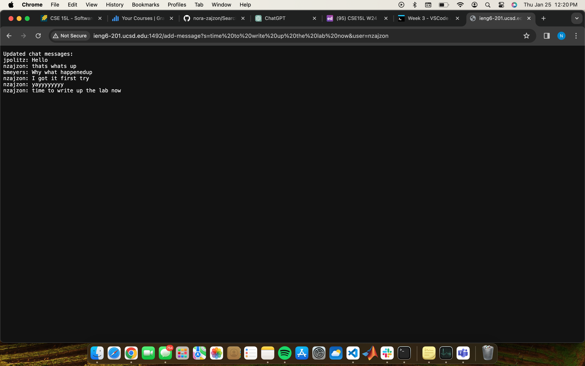
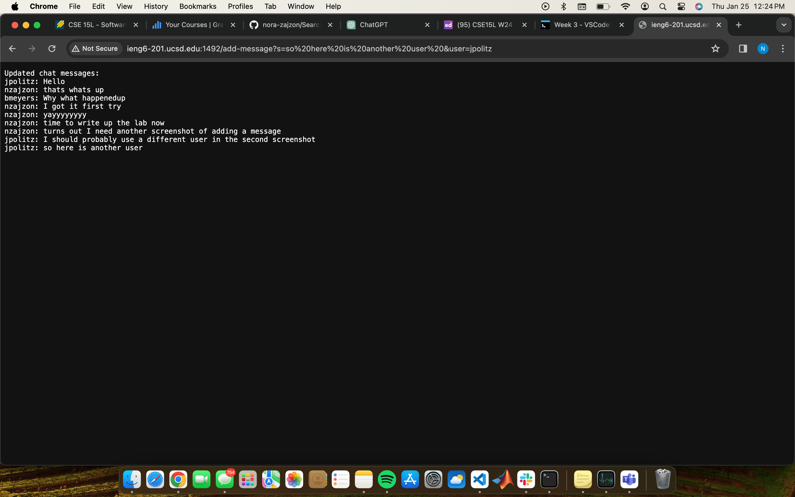

Nora Zajzon's Lab #2
=========

`Which methods in your code are called?`
1. handle method in the ServerHttpHandler class (entry point for handling HTTP requests)
2. handleRequest method in the class that implements the URLHandler interface (specific logic for handling the request)
`What are the relevant arguments to those methods, and the values of any relevant fields of the class?`
`How do the values of any relevant fields of the class change from this specific request? If no values got changed, explain why.`

`Which methods in your code are called?`
`What are the relevant arguments to those methods, and the values of any relevant fields of the class?`
`How do the values of any relevant fields of the class change from this specific request? If no values got changed, explain why.`
