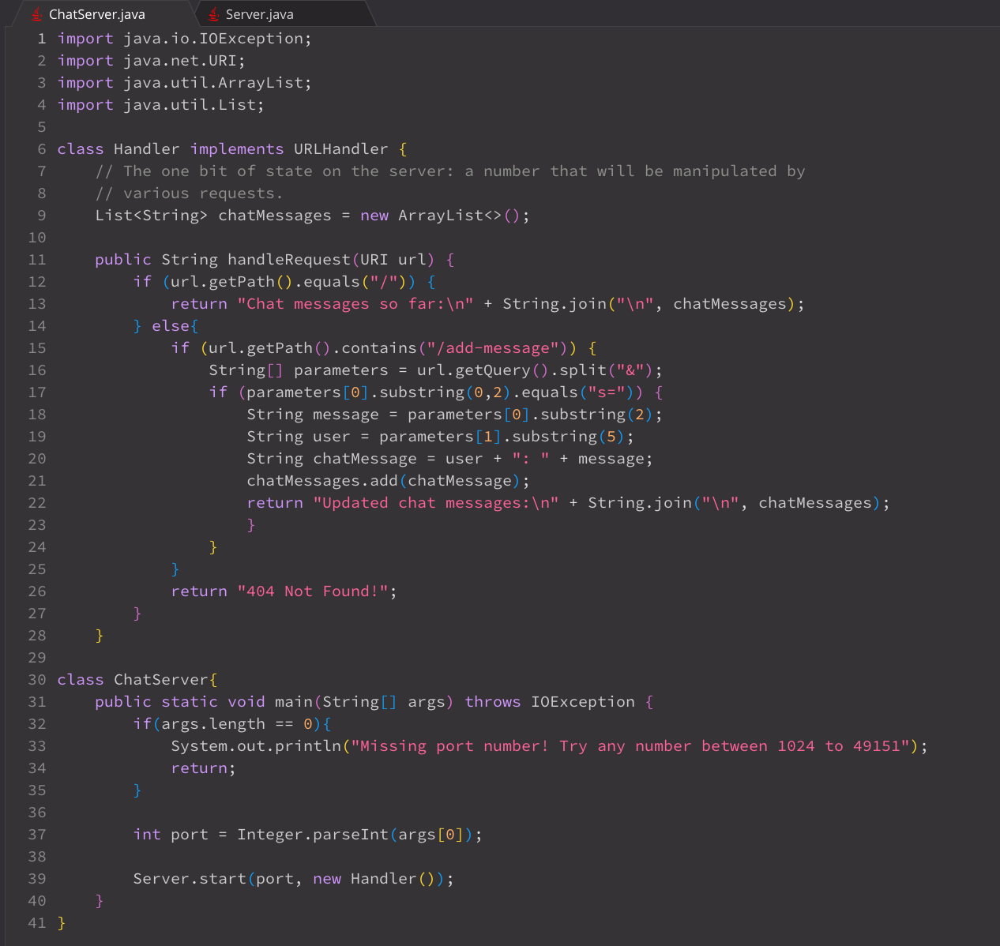
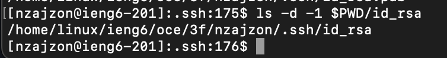
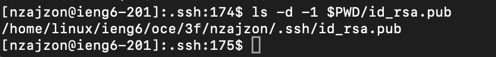
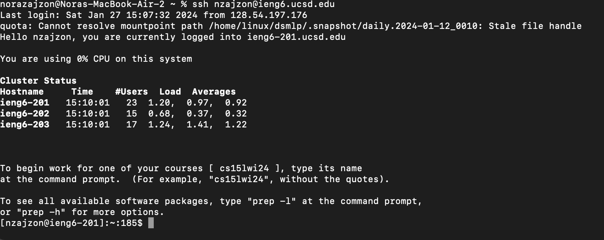

Nora Zajzon's Lab #2
=========

`Which methods in your code are called?`
1. `handle` method in the `ServerHttpHandler` class (entry point for handling HTTP requests)
2. `handleRequest` method in the class that implements the `URLHandler` interface (specific logic for handling the request)
   
`What are the relevant arguments to those methods, and the values of any relevant fields of the class?`
1. `handle` method has an argument of `HttpExchange exchange`. The exchange argument contains the value of `requestURI`. A relevant field is `handler` of class `Server`.
2. The `handleRequest` method has an argument of `URI url`. The url argument path contains: "http://ieng6-201.ucsd.edu:1492/add-message?s=time%20to%20write%20up%20the%20lab%20now&user=nzajzon". The field `chatMessages` which is a member of the class `ChatServer` is a String[] array.

`How do the values of any relevant fields of the class change from this specific request? If no values got changed, explain why.`
1. `handler` is an `URLHandler` that is not changed but invoked to execute the `handleRequest()` method.
2. `chatMessages` is changed when the values of the user and message are extracted from the url and concatenated into a string which is appended to the array `chatMessages`. In this example, the `chatMessage` "nzajzon: time to write up the lab now" is appended to `chatMessages`.

`Which methods in your code are called?`
1. `handle` method in the `ServerHttpHandler` class (entry point for handling HTTP requests)
2. `handleRequest` method in the class that implements the `URLHandler` interface (specific logic for handling the request)
   
`What are the relevant arguments to those methods, and the values of any relevant fields of the class?`
1. `handle` method has an argument of `HttpExchange exchange`. The exchange argument contains the value of `requestURI`. A relevant field is `handler` of class `Server`.
2. The `handleRequest` method has an argument of `URI url`. The url argument path contains: "http://ieng6-201.ucsd.edu:1492/add-message?s=so%20here%20is%20another%20user%20&user=jpolitz". The field `chatMessages` which is a member of the class `ChatServer` is a String[] array.
   
`How do the values of any relevant fields of the class change from this specific request? If no values got changed, explain why.`
1. `handler` is an `URLHandler` that is not changed but invoked to execute the `handleRequest()` method.
2. `chatMessages` is changed when the values of the `user` and `message` are extracted from the url and concatenated into a string which is appended to the array `chatMessages`. In this example, the `chatMessage` "jpolitz: so here is another user" is appended to `chatMessages`.

## The absolute path to the private key for your SSH key for logging into ieng6

## The absolute path to the public key for your SSH key for logging into ieng6

## A terminal interaction where you log into your ieng6 account without being asked for a password.

`In a couple of sentences, describe something you learned from lab in week 2 or 3 that you didn't know before:` Something I learned about in lab this week that I did not know before was setting up SSH public keys. The process involves generating a key pair which consists of a public and private key. The public key is then added to the authorized_keys file on the server, allowing secure authentication without a password. This enhances security by enabling secure and passwordless access to remote servers.
